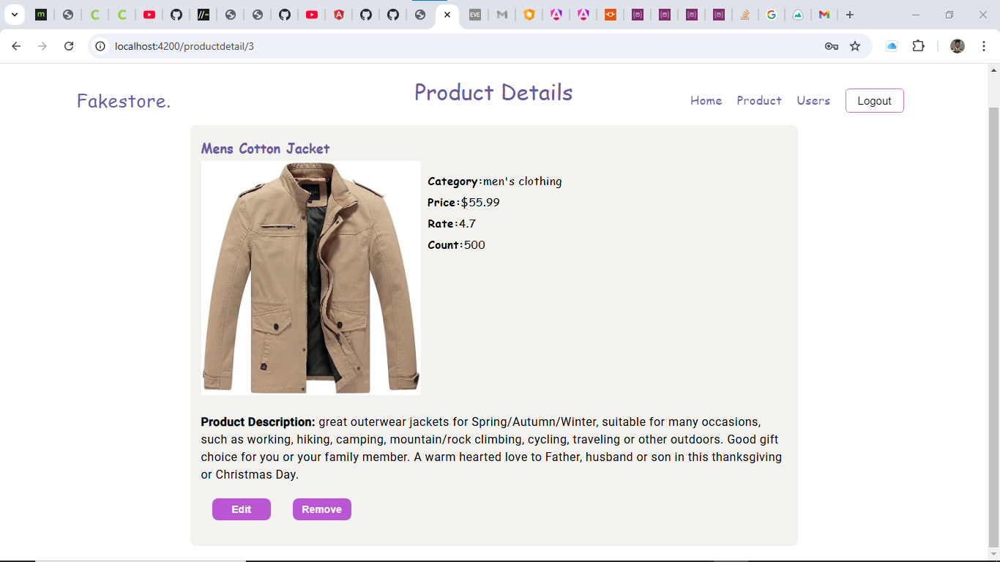
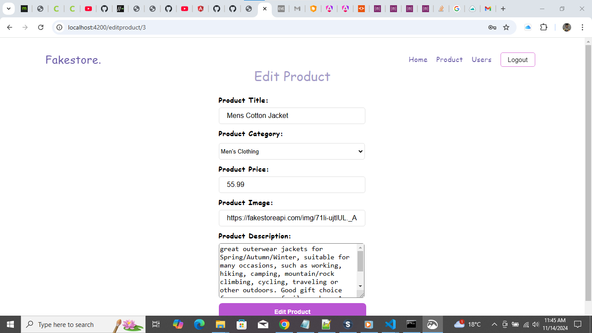
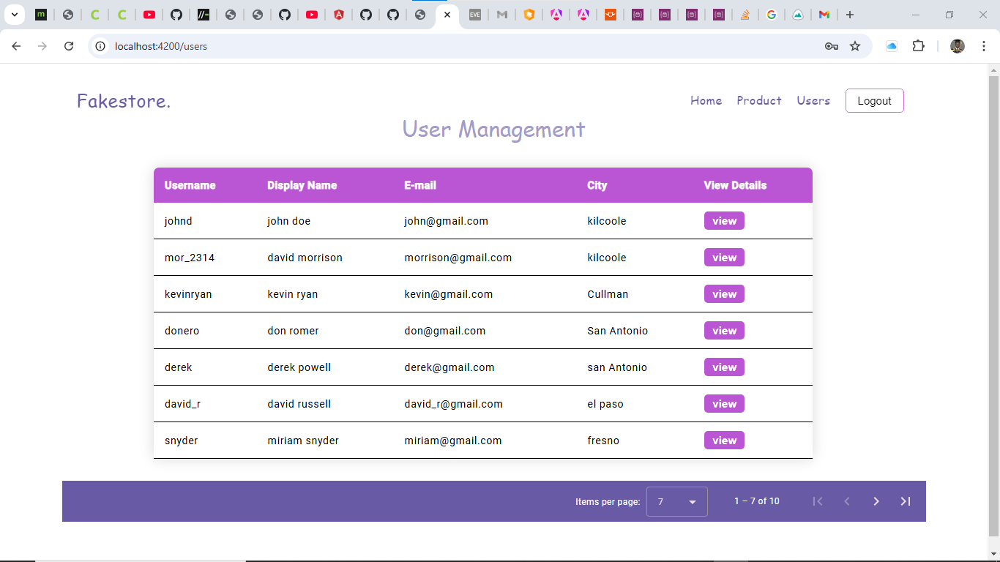

# Table of Content

- [introduction](#introduction)
- [Features](#features)
- [Technoligies and Software Tools](#technologies-and-software-tools)
- [Getting Started](#getting-started)
- [Usage](#usage)
- [Screenshot](#screenshot)
- [Live Demo](#live-demo)
- [Author](#author)

## Introduction

Welcome to my fakestore e-commerce admin dashboard app. A simple, yet powerful product management system built using angular 18.  

## Features

1. Login functionality.
2. Add product functionality
3. Edit product functionality.
4. Delete Product functionality.
5. Fliter functionality.

## Technologies and Software Tools

1. Front-End - HTML5, CSS.
2. Back-End - TypeScript
3. Database - Fakestore API
4. Software tools - Visual Studio Code and GitHub.

## Getting Started

1. Clone the repository: git clone [https://github.com/Mncedisi95/fakestore]
2. Install dependencies: npm install.
3. Start the development server: npm start.
4. Build and Deploy: npm run build and npm run deploy.
5. Switch to a specific branch: git checkout master
6. Pull changes from remote repository: git pull master
7. Run tests for the project: npm run test.
8. Run linter checks for code quality: npm run link.
9. Generate documentation for the project: npm run docs.

## Usage

1. Sign in with username: johnd and password: m38rmF$ or any available at [https://fakestoreapi.com/users].
2. View all products.
3. Select one product to view its details.
4. Start adding, updating and removing products.
5. View all users available.

## Screenshot

## Live Demo

This Todo website is live at: [https://mncedisi95.github.io/fakestore]

## Author

1. Name: Mncedisi Masondo
2. Email: [mncedisimasondo4@gmail.com]